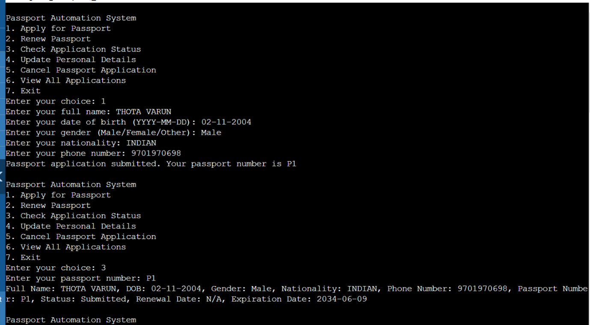
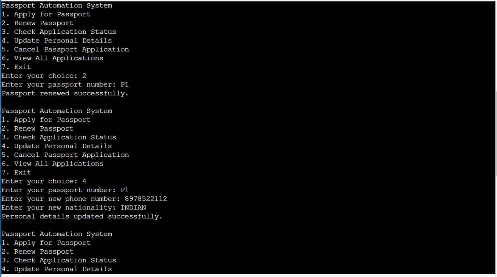
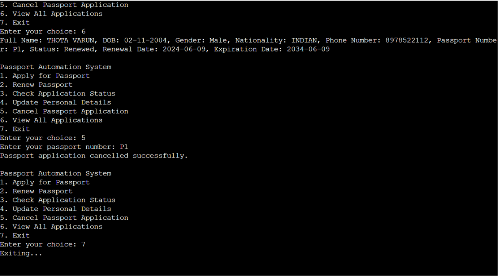

# Passport-Automation-System
passport automation system using java

# INTRODUCTION
In today's fast-paced world, managing passport applications efficiently is crucial for both applicants and authorities. The manual processing of passport applications can be time-consuming and error-prone, leading to delays and inconvenience. To address these challenges, a Passport Automation System is developed using Java. This project aims to streamline the passport application process, improve accuracy, and enhance user experience.

# REQUIREMENTS

1.Operating System: Windows, macOS, or Linux
2.Java Development Kit (JDK): JDK 8 or higher
3.Integrated Development Environment (IDE): Eclipse, IntelliJ IDEA, or NetBeans

# outputs

